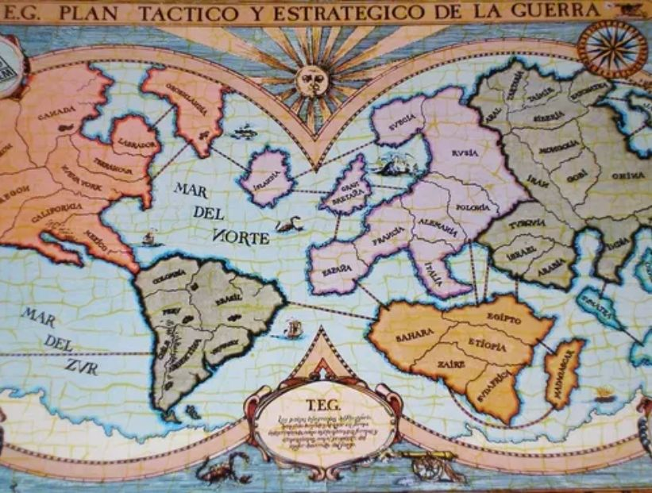

  

# TEG

El TEG (Táctica y Estrategia de la Guerra) es un clásico juego de mesa de estrategia que desafía a los jugadores a 
conquistar el mundo mediante la planificación, la negociación y la toma de decisiones tácticas. Inspirado en juegos 
de guerra y geopolítica, el TEG combina azar y estrategia, obligando a los jugadores a gestionar recursos, evaluar 
riesgos y anticipar movimientos enemigos para lograr sus objetivos de dominación global. El juego propone un 
conflicto bélico que tiene lugar sobre un mapa-tablero dividido en 50 países.

## Creado tomando como guía este reglamento

[REGLAMENTO](./docs/assets/TEG.pdf)