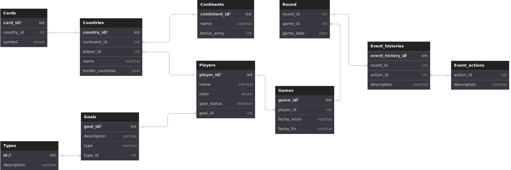

## Sección: Backend

### Modelo de Clases

---

### Clase `Goal`

#### Atributos
- `description: protected String`

#### Métodos
- `+ getDescription(): String`
- `+ isFulfilled(player: Player, game: Game): bool`

---

### Clase `Player`

#### Atributos
- `name: String`
- `goal: Goal`
- `selectedColor: ColoursEnum`
- `cardDrawDiceRoll: int`
- `countries: List<Country>`
- `armyCount: int = 100`
- `selectedDiceValue: int`
- `cards: List<Card>`
- `state: State`

#### Métodos
- `+ getCardDrawDiceRoll(): int`
- `+ rollCardDrawDice(): void`
- `+ throwDice(n): int[]`
- `+ receiveCard(card: Card): void`
- `+ setArmyInCountries(count: ?int, id: ?int): void`
- `+ getValidAttackOptions(): List<Pair<Country, Country>>`
- `+ getValidRegroupOptions(): List<Pair<Country, Country>>`
- `+ eliminate(): void`

---

### Clase `Map`

#### Atributos
- `continents: List<Continent>`

---

### Clase `Country`

#### Atributos
- `name: String`
- `armies: int`
- `owner: Player`
- `neighbours: List<Country>`
- `continent: Continent`

#### Métodos
- `+ isNeighbour(country: Country): bool`

---

### Clase `Continent`

#### Atributos
- `name: String`
- `countries: List<Country>`

#### Métodos
- `+ isControlledByPlayer(player: Player): bool`
- `+ getBonusArmyCount(): int`

---

### Clase `Card`

#### Atributos
- `country: Country`
- `symbol: SymbolEnum`

---

### Clase `Game`

#### Atributos
- `players: List<Player>`
- `map: Map`
- `currentTurn: Player`
- `events: EventManager`
- `cards: List<Card>`
- `timer: int = 10`
- `isGameOver: bool`
- `commonObjective: int = 30`
- `state: State`
- `strategy: Strategy`

#### Métodos
- `+ changeState(State)`
- `+ start(): void`
- `+ nextTurn(): void`
- `+ dealCards(): void`
- `+ attack(): void`
- `+ changePlayerStatus(): void`
- `+ insertArmy(): void`
- `+ regroupArmy(): void`
- `+ assignGoals(): void`
- `+ gameOver(): void`
- `+ saveProgress(): void`
- `+ uploadProgress(): void`
- `+ shuffleCards(): List<Card>`
- `+ distributeGoal(): void`
- `+ initialPlacement(): void`
- `+ getCurrentPlayer(): Player`
- `+ eliminatePlayerIfNoCountries(player: Player): void`

---

### Clase Abstracta `State`

#### Atributos
- `game: Game`

#### Métodos
- `+ State(player: Player)`
- `+ start(): void`
- `+ nextTurn(): void`
- `+ gameOver(): void`

#### Subclases
- `InitialState` → `+ start(): void`
- `ProgressState` → `+ nextTurn(): void`
- `GameOverState` → `+ gameOver(): void`

---

### Interfaz `Strategy`

#### Atributos
- `pathFinder: PathFinder`

#### Métodos
- `+ reinforce(game: Game, player: Player): void`
- `+ attack(game: Game, player: Player): void`
- `+ regroup(game: Game, player: Player): void`

#### Implementaciones
- `NoviceStrategy`
- `BalancedStrategy`
- `ExpertStrategy`

---

### Clase `PathFinder`

#### Métodos
- `+ findShortestPath(from: Country, to: Country, game: Game): List<Country>`
- `+ calculateWeight(from: Country, to: Country): int`

---

### Clase `EventManager`

#### Atributos
- `observables: List<Observer>`

#### Métodos
- `+ subscribe(observer: Observer): void`
- `+ unsubscribe(observer: Observer): void`
- `+ notify(event: EventHistory): void`

---

### Interfaz `Observer`

#### Método
- `+ update(event: EventHistory): void`

#### Implementaciones
- `NotificationObserver`
- `DatabaseObserver`

---

### Clase `EventHistory`

#### Atributos
- `round: Round`
- `eventAction: EventActions`
- `description: String`

---

### Clase `EventActions`

#### Atributos
- `description: String`

## Seccion: Base de Datos

### DER

